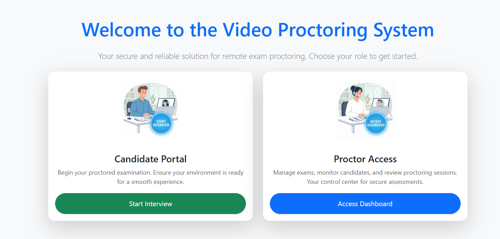

# 🎥 Video Proctoring System

This project is a **real-time interview proctoring system** built with React (Vite) for the frontend and Node.js/Express for the backend.  
It tracks user **eye movement, head position, and distractions** using [MediaPipe Face Landmarker](https://developers.google.com/mediapipe).

---

SCREEN SHOTS
Home page


Interviewee Interface


Live Stream and Recording for interviewer 


Dashboard


## 🚀 Getting Started

### 1. Clone the Repository
```bash
git clone <your-repo-url>
cd video-proctoring-system
```

### 2. Install Dependencies
Install dependencies for both frontend and backend:

```bash
# Frontend
cd frontend
npm install

# Backend
cd ../backend
npm install
```

---

## ▶️ Running the Application

### Start Backend
From the `backend` directory:
```bash
npm run dev
```
This will start the backend server (Express + Socket.io).

### Start Frontend
From the `frontend` directory:
```bash
npm run dev
```
This will start the Vite React app.

---

## 🌍 Environment Variables

### Frontend
Create a `.env` file inside `frontend` and add:

```env
VITE_BACKEND_URL=http://localhost:4000
```

> Replace `http://localhost:4000` with your backend server URL if running in Docker or production.

---

## 📋 Instructions for Testing Distraction Logging

1. Start the frontend and backend as explained above.
2. Enter your **name** in the modal when prompted.
3. Click **Start Interview** to enable the webcam.
4. **To trigger distraction logs:**  
   - Move your eyes away from the screen for at least **2 seconds**.  
   - The system will log an event and send it to the backend.

---

## 🛠️ Tech Stack
- **Frontend:** React (Vite), Socket.io-client, Mediapipe Vision
- **Backend:** Node.js, Express, Socket.io
- **Video Analysis:** MediaPipe Face Landmarker
- **Build/Deploy:** Docker

---

## 👨‍💻 Author
Developed by **Narayan Dewasi**  
Full-stack Developer | MERN | AI Enthusiast
